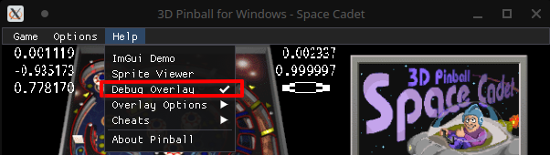
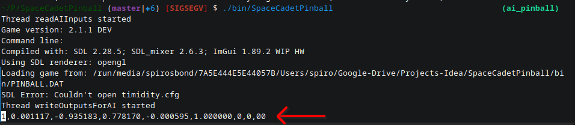
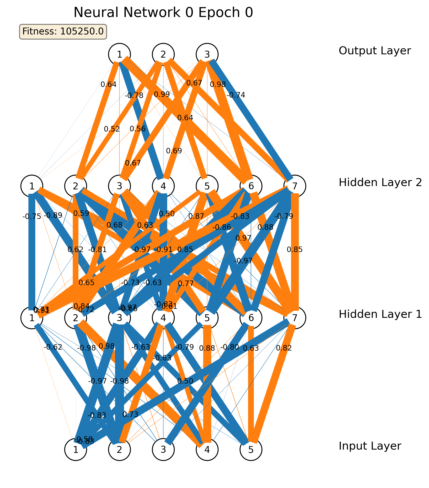

# pAInball - AI Plays Space Cadet Pinball

## Summary

This is a fun project that aims to train an Neural Network to play the famous `3D Pinball - Space Cadet`, a game bundled with Windows 95 and XP.

To build this project, special thanks have to go to [k4zmu2a/SpaceCadetPinball](https://github.com/k4zmu2a/SpaceCadetPinball) repo. Refer to that project for more information about porting `Space Cadet`.

## How to build and play the game

You need to download the game resources (.dat & audio files) and place them in the `bin/` directory.
These resources are not included, but should be easy to find - just google it.

Afterwards, follow the below steps.

## Compiling

### On Windows

TBD - please contribute :)

### On Linux

Install devel packages for `SDL2`, `SDL2_mixer` and `SDL2_ttf`.\
Insatll `cmake` and `ninja` and compile with CMake; tested with GCC 10, Clang 11.\

At the root of the repo run:
```bash
cmake -GNinja .  
ninja
```

The executable should be under folder `bin/SpaceCadetPinball`. You can play it by running:

```bash
./bin/SpaceCadetPinball
```

### On macOS

TBD - please contribute :)

### Changes done to SpaceCadet Source code

In order to enable the AI to play the game, the source code of SpaceCadet had to be enhanced. These are the topline changes:

- Thread to output to stdout the inputs required for the Neuran Network
- Thread to read from stdin the outputs of the Neuran Network and to perform the commanded action
- By using the SDL2_ttf package, visualize on the screen the inputs to the Neural Network

### See the game feedback

You can enable the game feedback via the stdout by enabling the "Debug Overlay" option:





## AI that Sh\*t 🤖

A Neuran Network has been developed to play the game. The [NEAT](https://en.wikipedia.org/wiki/Neuroevolution_of_augmenting_topologies) genetic algorithm is used to create a generation, find the best performer(s), perform crossover and mutations and repeat. The best performer(s) of each epoch are stored, to allow continuing the training from a specific generation.

Signs of playing "intelligence" start to show up after ~100 generations, but your results may vary due to the random starting point.

### Neural Network architecture

A Neural Network with 2 hidden layers of 7 nodes each was used.

Inputs:

- Location of the ball (X, Y)
- Speed of the ball
- Direction of the ball (X, Y)

Outputs:

- Do nothing
- Actuate Left Flipper
- Actuate Right Flipper


Parameters for the fitness function:

- Score
- Number of ball hits with the Left Flipper
- Number of ball hits with the Right Flipper
- Ball drained flag

Example:




### Python Dependencies

See `AIPlayer/pip_packages.txt`

Install via: `pip install -r pip_packages.txt`

In order to tidy the multiple games on the screen to have a good overview, the system package `wmctrl` is used in `run_game.py` in function `resize_window()`. Install it based on your OS.

### Run the AI

Execute the following to start from scratch (random Neural Networks):

```bash
python AIPlayer/run_game.py
```

Execute the following to start from specific parents

```bash
python AIPlayer/run_game.py <path_to_parent_0_weights.csv> <path_to_parent_1_weights.csv> ...
```

For the AI to receive game feedback, make sure you enable the Debug Overlay in the game settings:


### AI Project structure

All the logic related to the AI is under `AIPlayer`.

- `neural_ntw.py`: Implementation of a Neural Network class
- `nn_genetics.py`: Implementation of the NEAT genetic algorithm for NN
- `nn_visualization.py`: Implementation of helper classes to visualize the Neural Networks and their weights (see [Special Thanks](#special-thanks))
- `run_game.py`: Main script

At the end of each epoch the script outputs the following:

- All parents in csv format at: `AIPlayer/runs/<config_timestamp>/ep<X>_parent_<Y>_id<Z>_<fitness>.csv`
- All parents visualizations in png format at: `AIPlayer/runs/<config_timestamp>/ep<X>_parent_<Y>_id<Z>.png`
- The last parents visualizations: `AIPlayer/runs/<config_timestamp>/live_<Y>.png`

### AI Player Configuration

In `run_game.py`:
```python
num_of_nns = 30 # Set the number of Neural Network Children per epoch
num_of_rand_children = 5 # Number for additional random Neural Networks per epoch
...
hidden_layers = [7,7] # Number of hiden layers and their nodes
start_timeout = 30; # Starting game duration per epoch. It is increasing by 10 sec every 10 epoch
```

## Future Plans

- Train a Neural Network with more output actions
- Optimize fitness function to punish erratic behaviour
- Use PPO Algorithm for evolving the Neural Network

## Special Thanks and Useful Sources

- Space Cadet port: [k4zmu2a/SpaceCadetPinball](https://github.com/k4zmu2a/SpaceCadetPinball)
- Useful library for Neural Network Visualization: [jzliu-100/visualize-neural-network](https://github.com/jzliu-100/visualize-neural-network)
- Multilinear NN example: [miloharper/multi-layer-neural-network](https://github.com/miloharper/multi-layer-neural-network)
- Genetic Algorithm for optimizing a NN: [luaffjk/ga-mlp](https://github.com/luaffjk/ga-mlp)